# Нанокоты
Всем кискам "Пис!" - я из НИТУ МИСИС
бла бла

# Робот от команды Нанокоты

## Электроника

Необходимые электронные компоненты: цилиндрический литий-ионный
аккумулятор 3.7 V, мотор-редуктор, светодиод, резистор 50-100 Ω,
батарейный отсек, тумблер, соединительные провода

Электрическая схема:

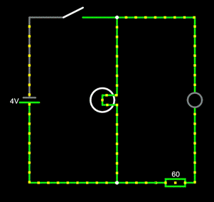

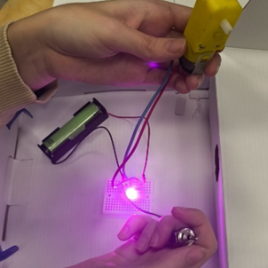

## Дизайн

Было решено спрятать электрическую конструкцию в коробку. Примерные
зарисовки представлены на картинках:

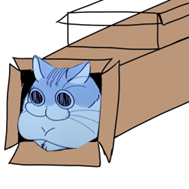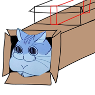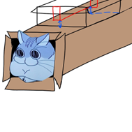

Основная задача робота состояла в создании «ножек». Далее представлены
источники, которыми мы вдохновились.

Источник: <https://www.youtube.com/watch?v=gTIaTd0_7bk>

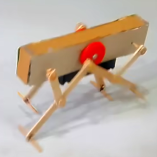

Источник: <https://www.youtube.com/watch?v=IpwZKaRav4c>

Далее было принято решение симулировать механизм для более лучшей
наглядности.

Опробовав все 3 механизма, самым эффективным оказался механизм,
расположенный в центре.

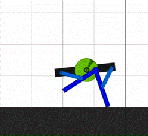

Далее создавались детали.

Диск (ротор) со ступицей и эксцентриковым отверстием представлен на
следующих картинках. Все измерения выполнены в миллиметрах.

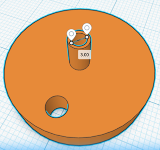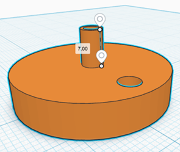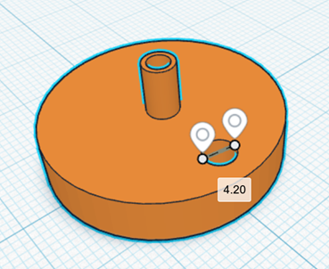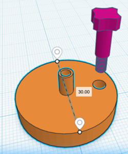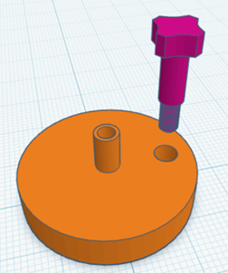

В качестве ножек использовались деревянные пластины.

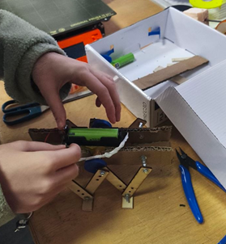

Затем из картона было сделано основание (коробка), на которую позже были
приклеены мотор и батарейный отсек.

## Тестирование

Из основных минусов это отсутствие синхронности, из-за чего робот
совершает движение по окружности больше чем, прямое.

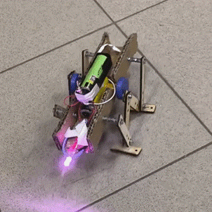

## Декор

Для скрывания внутренней конструкции робота были разработаны
дополнительные детали.

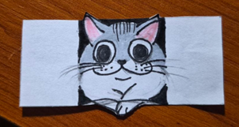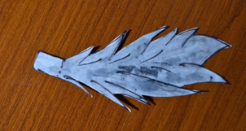

## Примечания для оптимизирования робота

Необходимо изменить направление винта и заменить на длину побольше.

