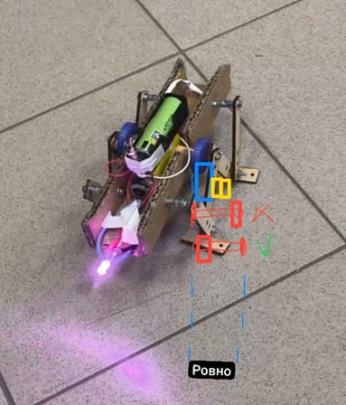

# Нанокоты
Всем кискам "Пис!" - я из НИТУ МИСИС
бла бла

## Содержание
* [Робот от команды нанокоты](#робот-от-команды-нанокоты)
    * [1. Электроника](#1-электроника)
    * [2. Дизайн](#2-дизайн)
    * [3. Тестирование](#3-тестирование)
    * [4. Декор](#4-декор)
    * [5. Примечания для оптимизации робота](#5-примечания-для-оптимизации-робота)

# Робот от команды Нанокоты

## 1. Электроника

Необходимые электронные компоненты: цилиндрический литий-ионный
аккумулятор 3.7 V, мотор-редуктор, светодиод, резистор 50-100 Ω,
батарейный отсек, тумблер, соединительные провода

Электрическая схема:

## 2. Дизайн

Было решено спрятать электрическую конструкцию в коробку. Примерные
зарисовки представлены на картинках:

Основная задача робота состояла в создании «ножек». Далее представлены
источники, которыми мы вдохновились.

Источник: <https://www.youtube.com/watch?v=gTIaTd0_7bk>

Источник: <https://www.youtube.com/watch?v=IpwZKaRav4c>

Далее было принято решение симулировать механизм для более лучшей
наглядности.

Опробовав все 3 механизма, самым эффективным оказался механизм,
расположенный в центре.

Далее создавались детали.

Диск (ротор) со ступицей и эксцентриковым отверстием представлен на
следующих картинках. Все измерения выполнены в миллиметрах.

В качестве ножек использовались деревянные пластины.

Затем из картона было сделано основание (коробка), на которую позже были
приклеены мотор и батарейный отсек.

## 3. Тестирование

Из основных минусов это отсутствие синхронности, из-за чего робот
совершает движение по окружности больше чем, прямое.

## 4. Декор

Для скрывания внутренней конструкции робота были разработаны
дополнительные детали.

## 5. Примечания для оптимизации робота

Необходимо изменить направление винта и заменить на длину побольше.

## Примечания для оптимизирования робота

Необходимо изменить направление винта и заменить на длину побольше.

